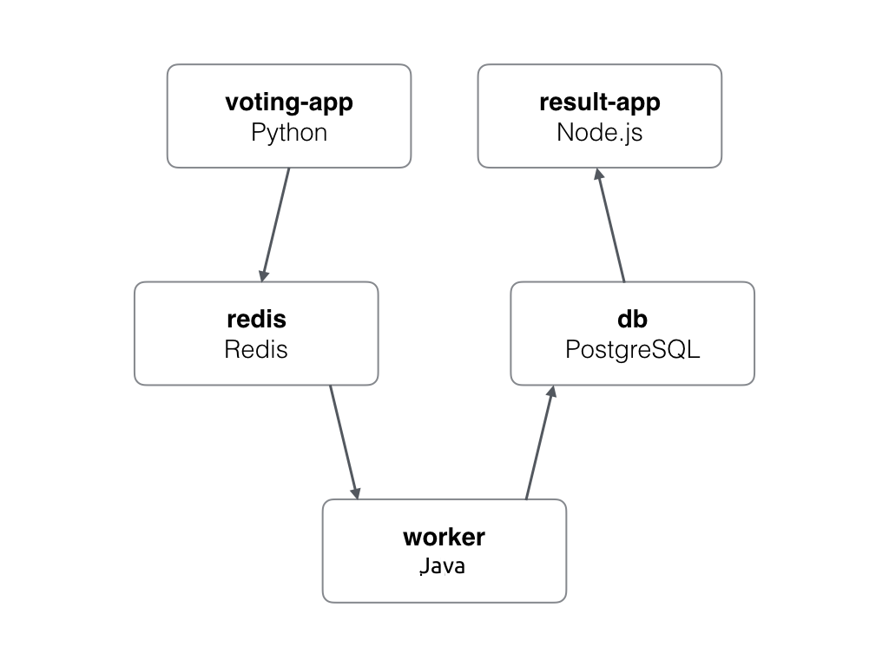

# Docker : Example Voting App

The purpose of this project is to propose a simple Docker voting app to be able to understand some Docker principles.

## Description

This repository is forked from that [repository](https://github.com/dockersamples/example-voting-app).

The voting app is based on that architecture :

*   A Python webapp which lets you vote between two options
*   A Redis queue which collects new votes
*   A Java worker which consumes votes and stores them in a Postgres database
*   A Postgres database backed by a Docker volume
*   A Node.js webapp which shows the results of the voting in real time

The architecture can be schematized like this :



Be aware that the voting application only accepts one vote per client. It does not register votes if a vote has already been submitted from a client.

## Getting Started

These instructions will get you a copy of the project up and running on your local host for development and testing purposes.

To deploy this project on Openshift or Kubernetes, please refer to https://github.com/PXL-Systems-Expert/kubernetes_voting.git 

### Prerequisites

What things you need to deploy this app :

*   Docker has to be installed on the control host
*   A Docker Hub account or a private registry account is required to push the images

## Usage

To be able to play with the voting app, some steps has to be followed :
1.  Deploy Postgres and create a default database
2.  Deploy Redis
3.  Build and run the vote service
4.  Build and run the result service
5.  Build and run the worker service

### Postgres

First, Postgres has to be deployed and the database initialized with a secured password.

By default, the Postgres database initiate will be named "voting" like the user. The default password will be "mysecretpassword".

The docker command to deploy the Postgres database on the local host should be :

```
$ docker run --name db -e POSTGRES_DB=voting -e POSTGRES_USER=voting -e POSTGRES_PASSWORD=mysecretpassword -d postgres
Unable to find image 'postgres:latest' locally
latest: Pulling from library/postgres
802b00ed6f79: Pull complete
4e0de21e2180: Pull complete
58b06ac4cd84: Pull complete
14e76b354b47: Pull complete
0f0c9f244b65: Pull complete
37117d8abb6d: Pull complete
8b541f5d818a: Pull complete
7cb4855fcd96: Pull complete
5c7fe264586b: Pull complete
64568a495c35: Pull complete
283257efa745: Pull complete
222b134fa51d: Pull complete
e9a30e7f2a9f: Pull complete
86bffc7855b0: Pull complete
Digest: sha256:1d26fae6c056760ed5aa5bb5d65d155848f48046ae8cd95c5b26ea7ceabb37ad
Status: Downloaded newer image for postgres:latest
10887c9667eff3636cc213785617095bb59a8dc734e68350a60fb92f49730759
```

Docker will pull the image from Docker Hub and run the container :

```
CONTAINER ID        IMAGE               COMMAND                  CREATED             STATUS              PORTS               NAMES
10887c9667ef        postgres            "docker-entrypoint..."   3 seconds ago       Up 3 seconds        5432/tcp            db
```

### Redis

Second, Redis has to be deployed and the database initialized with a secured password.

By default, the redis database initiate will be secured by the default password "mysecretpassword".

The docker command to deploy the redis database on the local host should be :

```
$ docker run --name redis -e REDIS_PASSWORD=mysecretpassword -d redis
Unable to find image 'redis:latest' locally
latest: Pulling from library/redis
802b00ed6f79: Already exists
8b4a21f633de: Pull complete
92e244f8ff14: Pull complete
fbf4770cd9d6: Pull complete
1479f3bcce09: Pull complete
b4020173179f: Pull complete
Digest: sha256:b77926b30ca2f126431e4c2055efcf2891ebd4b4c4a86a53cf85ec3d4c98a4c9
Status: Downloaded newer image for redis:latest
02fa3d611e549c55fc34fb7089c5e273bc157719d607cf75fb2cca9ce004ec3a
```

Docker will pull the image from Docker Hub and run the container :

```
CONTAINER ID        IMAGE               COMMAND                  CREATED             STATUS              PORTS               NAMES
02fa3d611e54        redis               "docker-entrypoint..."   3 seconds ago       Up 3 seconds        6379/tcp            redis
10887c9667ef        postgres            "docker-entrypoint..."   1 minutes ago       Up 1 minutes        5432/tcp            db
```

### Vote

Third, the vote service has to be build and run on local host. The build image can be pushed on Docker Hub or any Docker registry if needed.

The DockerFile needed to build the vote application is located in the directory : sources/vote/DockerFile

The vote container is a simple python application exposing the port 8080 with two voting choice. The redis parameter like database password, redis service name will be passed in environment variables.

By default, the vote application will be deployed with the choice CAT or DOG.

The command to build the image based on the sources should be :

```
$ docker build sources/vote -t vote:1.0
```

Once the image is build, the command to run the app should be :

```
$ docker run --name vote -e OPTION_A=CAT -e OPTION_B=DOG -e REDIS_SERVICE_NAME=redis -e REDIS_PASSWORD=mysecretpassword -d vote:1.0
```

Docker will detect the image locally and run the container :

```
CONTAINER ID        IMAGE               COMMAND                  CREATED             STATUS              PORTS               NAMES
jdn3n5nf2nd9        vote                "docker-entrypoint..."   3 seconds ago       Up 3 seconds        8080/tcp            vote
02fa3d611e54        redis               "docker-entrypoint..."   1 minutes ago       Up 1 minutes        6379/tcp            redis
10887c9667ef        postgres            "docker-entrypoint..."   2 minutes ago       Up 2 minutes        5432/tcp            db
```

### Result

Fourth, the result service has to be build and run on local host. The build image can be pushed on Docker Hub or any Docker registry if needed.

The DockerFile needed to build the result application is located in the directory : sources/result/DockerFile

The result container is a simple nodejs application exposing the port 8080. The Postgres parameter like database name, user and password will be passed in environment variables.

To be able to run the result and the result application locally the default port of result app will be change to 8081.

The command to build the image based on the sources should be :

```
$ docker build sources/result -t result:1.0
```

Once the image is build, the command to run the app should be :

```
$ docker run --name result -e DB_SERVICE_NAME=db -e DB_NAME=voting -e DB_USERNAME=voting -e DB_PASSWORD=mysecretpassword -d result:1.0
```

Docker will detect the image locally and run the container :

```
CONTAINER ID        IMAGE               COMMAND                  CREATED             STATUS              PORTS               NAMES
zhxnz35nxh2n        result              "docker-entrypoint..."   3 seconds ago       Up 3 seconds        8081/tcp            result
jdn3n5nf2nd9        vote                "docker-entrypoint..."   1 minutes ago       Up 1 minutes        8080/tcp            vote
02fa3d611e54        redis               "docker-entrypoint..."   2 minutes ago       Up 2 minutes        6379/tcp            redis
10887c9667ef        postgres            "docker-entrypoint..."   3 minutes ago       Up 3 minutes        5432/tcp            db
```

### Worker

Fifth, the worker service has to be build and run on local host. The build image can be pushed on Docker Hub or any Docker registry if needed.

The DockerFile needed to build the worker application is located in the directory : sources/worker/DockerFile

The worker container is a simple java application that need to read Redis queue and write data in Postgres database. The Postgres parameter like database name, user and password will be passed in environment variables like the Redis informations.

The command to build the image based on the sources should be :

```
$ docker build sources/worker -t worker:1.0
```

Once the image is build, the command to run the app should be :

```
$ docker run --name worker -e REDIS_SERVICE_NAME=redis -e REDIS_PASSWORD=mysecretpassword -e DB_SERVICE_NAME=db -e DB_NAME=voting -e DB_USERNAME=voting -e DB_PASSWORD=mysecretpassword -d worker:1.0
```

Docker will detect the image locally and run the container :

```
CONTAINER ID        IMAGE               COMMAND                  CREATED             STATUS              PORTS               NAMES
xpd4nd9xz1l0        worker              "docker-entrypoint..."   3 seconds ago       Up 3 seconds                            worker
zhxnz35nxh2n        result              "docker-entrypoint..."   1 minutes ago       Up 1 minutes        8081/tcp            result
jdn3n5nf2nd9        vote                "docker-entrypoint..."   2 minutes ago       Up 2 minutes        8080/tcp            vote
02fa3d611e54        redis               "docker-entrypoint..."   3 minutes ago       Up 3 minutes        6379/tcp            redis
10887c9667ef        postgres            "docker-entrypoint..."   4 minutes ago       Up 4 minutes        5432/tcp            db
```

### Check deployment

At this point, each component should be deployed locally and everything should be up and running.

The vote web interface should be accessible at this point : [http://127.0.0.1:8080](http://127.0.0.1:8080)

The result web interface should be accessible at this point : [http://127.0.0.1:8081](http://127.0.0.1:8081)

## Author

Member of Wikitops : https://www.wikitops.io/

## Licence

This project is licensed under the Apache License, Version 2.0. For the full text of the license, see the LICENSE file.
